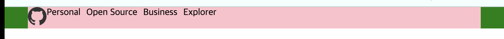

### 여백
- margin과 padding으로 구분할 수 있다.

> margin은 바깥쪽 여백, padding은 안쪽 여백을 지정한다.

<br>


- padding은 여백만큼 크기가 더 커진다.
- 각 방향 마다 개별 속성을 지정할 수도 있다.

```css
.a{
    margin: 10px; /* 단축속성으로, 상하좌우 모두 10px margin */

    /* 시계 방향으로 각각 지정할 수도 있다. */
    margin: 10px 5px 2px 0;

    margin: auto; /* 전체 width에서 좌우로 auto 여백을 가져 영역 안에서 중앙으로 몰아준다.  */

    margin-top: 10px; 
    margin-left: 10px; 
    margin-right: 10px; 
    margin-bottom: 10px; 
}

.b{
    padding: 10px; /* 단축속성으로, 상하좌우 모두 10px padding */

    /* 시계 방향으로 각각 지정할 수도 있다. */
    padding: 10px 5px 2px 0;

    padding-top: 10px;
    padding-left: 10px;
    padding-right: 10px;
    padding-bottom: 10px;
}
```

<br>


<details> 
<summary style="font-size:18px; color:pink;">margin: auto;</summary>


<div markdown="1">

```html
 <div class="header">
    <div class="container">
        <div class="container__left">
            <div class="logo">
                
            </div>
            <div class="menu">
                <div class="menu__item">Personal</div>
                <div class="menu__item">Open Source</div>
                <div class="menu__item">Business</div>
                <div class="menu__item">Explorer</div>
            </div>
        </div>
    </div>
</div>
```

```css
body{
    margin: 0;
    padding: 0;
}

.header{
    background-color: green;
}

.container{
    width: 980px;
    background-color: red;
    margin: auto;
}
```

<br>

#### result


</details>

<br>

---
### 기본적으로 지정되어 있는 사항들
1. 웹브라우저에서는 기본적으로 margin이 부여되어 있다.
    - 초기화를 하고 사용하는게 좋음
    - reset.css나 body에 margin/padding: 0을 부여하고 시작하는게 좋다!

2. font-size는 16px로 지정되어 있다.

3. width, height는 auto로 지정되어 있다.
    - width는 auto일 때 100%(화면 처음부터 끝까지)로 인식한다.
    - height는 auto일 때 0부터 출발한다.(내부에 들어있는 요소에 따라 자동적으로 height가 늘어난다.)

---
### 요소 가로 배치
- `display: flex` 로만 하는 줄 알았는데 `float: left`라는 것으로도 할 수 있었다.


<br>

- 요소를 띄우는 속성인데, 요소가 띄워지면서 가로로 배치된다고 함
    - 띄우는 과정에서 배경에 포함되지 않는데, 이를 해결할 수 있는게 clearfix임

- 여기서 띄운다는 의미가 쉽게 생각하면 ppt에서 도형 안에 글씨 쓰느냐, 도형 하나 만들고 다른 텍스트 박스 만들어서 올리냐로 이해하면 될 것 같다.
    - 종속되지 않고 독립적으로 존재하게 되기 때문에 menu에 대한 css가 먹지 않는 것 같다.
    - `position: absolute`와 유사한 의미를 가지는 것 같다..!

<br>

```css
.clearfix::after{
    content: "";
    display: block;
    clear: both;
}
```
- ::은 가상 요소 선택자라고 함
    - 엥 근데 뭐하는건지 아직은 몰라도 된다고 해서 뭐하는 친구인지 모르겠음


오 배경색 안에 메뉴바가 들어왔다!

<br>

> ⁉️ 음 근데 로고랑 메뉴 선택하는 거랑도 가로로 같이 배치되어야 하는데 되지 않고 있음

```css
.logo{
    float: left; /* 요소들을 가로로 배치하는 역할 */
}

.menu{
    float: left; /* 요소들을 가로로 배치하는 역할 */
}

.menu__item{
    float: left; /* 요소들을 가로로 배치하는 역할 */
    margin-right: 10px;
}

.clearfix::after{ /* float로 요소가 배경 바깥으로 벗어나는 문제 해결해줌*/
    content: "";
    display: block;
    clear: both;
}
```
- logo와 menu에도 float: left를 넣어 가로로 배치하게 되는데, 배경색이 벗겨진다..


- float: left는 clearfix로 껐다 켰다 해주는 작업이 필요한데 menu와 logo에 추가적으로 입력함에 따라 해당 과정을 수행하지 않았기 때문이라고 한다.
- `float: left` 들을 사용한 div의 부모인 `container__left`에 clearfix를 추가해주면 해결된다.

    ```html
    <div class="header">
        <div class="container">
            <div class="container__left clearfix">
                <div class="logo">
                    
                </div>
                <div class="menu clearfix">
                    <div class="menu__item">Personal</div>
                    <div class="menu__item">Open Source</div>
                    <div class="menu__item">Business</div>
                    <div class="menu__item">Explorer</div>
                </div>
            </div>
        </div>
    </div>
    ```

    

---
### 이미지 내 여백


이미지 태그를 사용하면 기본적으로 부여된 여백이 있다. 이는 레이아웃을 잡는 과정에서 불편으로 작용하게 되는데, `display: block` 으로 해결할 수 있다.


> 여백이라고 생각해서 `margin-bottom: 0;`을 써봤는데 안먹었다. 왤까?

---
### 메뉴바 수직 중앙 정렬하기
- `margin: auto`를 통해 좌우 중앙 정렬이 가능했다.
- 위아래는 paddiing을 추가하여 수직 또한 가운데 정렬이 가능하다.
    

    

- padding은 header, container, container-left 모두 동일하게 작용하지만, 최적화를 위해서는 최상위 요소 보다는 직접적으로 padding 효과를 받는 요소에 넣는 것이 좋다.
